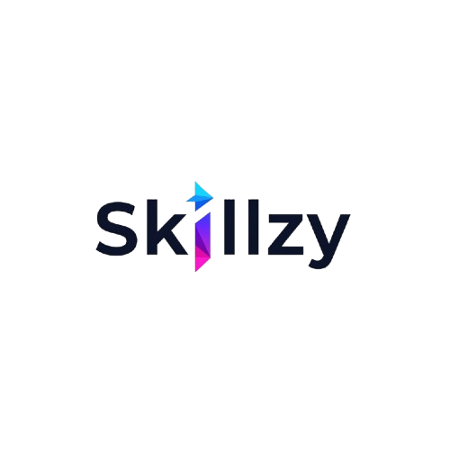

# Skillzy {.title}
{width=200px}

## Career Prediction System
### Technical & Business Overview

---

## 1. System Overview

### Project Objective
- AI-powered career guidance and prediction system
- Intelligent career path recommendations
- Data-driven decision support

### Architecture
- Flutter Frontend: User interface and experience
- Node.js Backend: Business logic and API management
- Python ML Model: Career prediction engine

---

## 2. Machine Learning Model

### Neural Network Architecture
- **Input Layer**: 27 neurons (career indicators)
- **Hidden Layers**: 
  - Layer 1: 64 neurons + ReLU + Dropout(0.3)
  - Layer 2: 64 neurons + ReLU + Dropout(0.3)
- **Output Layer**: Softmax activation for career classification

### Training Configuration
- **Optimizer**: Adam
- **Loss Function**: Categorical Cross-Entropy
- **Training Parameters**:
  - Epochs: 50
  - Batch Size: 32
  - Validation Split: 20%

---

## 3. Data Processing Pipeline

### Feature Engineering
- 27 carefully selected numerical features
- Comprehensive career indicators
- Standardized data format

### Processing Flow
1. Data Collection & Validation
2. Feature Extraction & Normalization
3. Model Prediction & Confidence Scoring

### Data Flow
```
User → Frontend → Backend → ML Model → Backend → Frontend → User
```

---

## 4. Model Integration

### Backend-ML Integration
- Python script execution for predictions
- Data format conversion and validation
- Result processing and confidence scoring

### Performance Optimization
- Pre-trained model loading
- Caching system for frequent predictions
- Batch processing capabilities
- Memory and CPU optimization

---

## 5. Security & Reliability

### Data Protection
- Input validation and sanitization
- Secure API endpoints
- Model file security
- Access control and version management

### Error Handling
- Comprehensive logging
- Error recovery mechanisms
- User feedback system
- Audit logging

---

## 6. Technical Implementation

### Technology Stack
- **Frontend**: Flutter, Material Design
- **Backend**: Node.js, Express, MongoDB
- **ML**: TensorFlow, scikit-learn, Python 3.x

### Development Infrastructure
- Version control
- CI/CD pipeline
- Testing framework
- Performance monitoring

---

## 7. Future Roadmap

### Technical Enhancements
- Model versioning and A/B testing
- Performance optimization
- Automated testing
- Advanced analytics

### Feature Expansion
- Real-time predictions
- Batch processing
- User feedback system
- Enhanced reporting

---

## Thank You! {.section}

### Contact Information
- **Email**: support@skillzy.com
- **Website**: www.skillzy.com
- **Documentation**: docs.skillzy.com